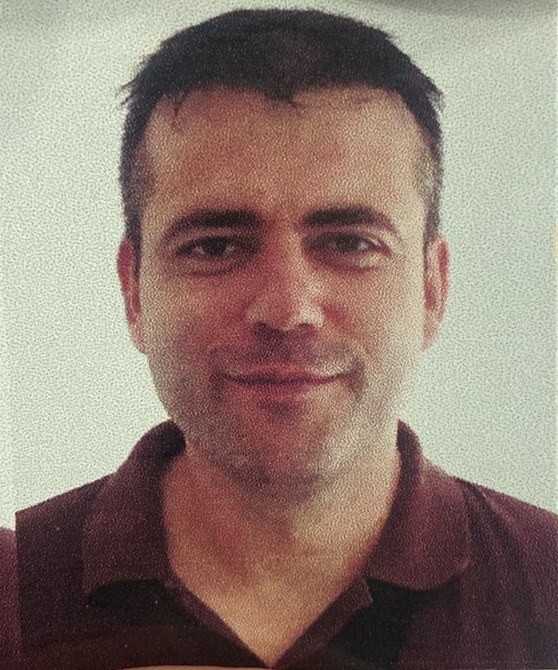

# Обо мне
Меня зовут Антон Астахов. Мне 39 лет. В будущем, я надеюсь стать программистом.
## Моя короткая история
До 2022 года я был предпринимателем в России. В сентябре 2022 я уехал из России и решил освоить новую профессию - стать программистом. До начала обучения я не имел  навыков в программировании.  
## Мои впечатления на первом этапе.
Не могу сказать, что обучение дается мне легко. Но процесс очень увлекает, что дает основания для осторожного оптимизма)).
## Фото

